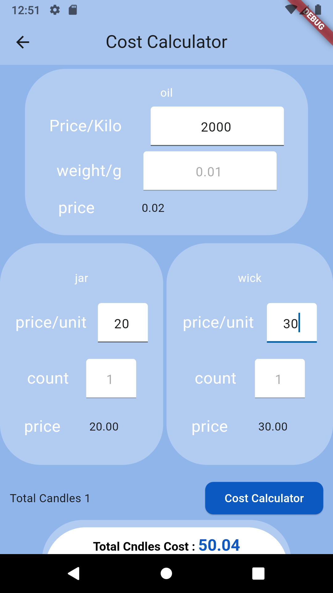

# Candly

This is Candly , It is an app to calculate prices for candle industry process . The main goal of this project was to calculate the price of jars,wax types ,.. etc .

## Why this project ?

This project is a Flutter application. help user to calculate the process of making candles, it's easy and simple to use!
it give the maker ability to track price of each type

## Some Screens

<table>
  <tr>
    <th>Screen</th>
    <th>Description</th>
    
  </tr>
  <tr>
    <td> </td>
    <td><strong>Main Screen</strong></td>
    
  </tr>
  <tr>
    <td> </td>
    <td>
    <strong>types wax Screen</strong></td>
   
    
    
  </tr>
  
  <tr>
    <td> </td>
    <td><strong>Add Prepare Area </strong></td>
    
  </tr>

  <tr>
    <td> </td>
    <td><strong>Add ingredients</strong></td>
    
  </tr>
  <tr>
    <td> </td>
    <td><strong>result Screen</strong></td>
    
  </tr>
  <tr>
    <td> </td>
    <td><strong>Saved Temples</strong></td>
    
  </tr>
  <tr>
    <td> </td>
    <td><strong>Drawer</strong></td>

  <tr>
    <td> </td>
    <td><strong>Main Screen Ar </strong></td>
    
  </tr>
  <tr>
    <td> </td>
    <td><strong>wax type percent Ar</strong></td>
    
  </tr>
  <tr>
    <td> </td>
    <td><strong>price Screen Ar </strong></td>
    
  </tr>

</table>
